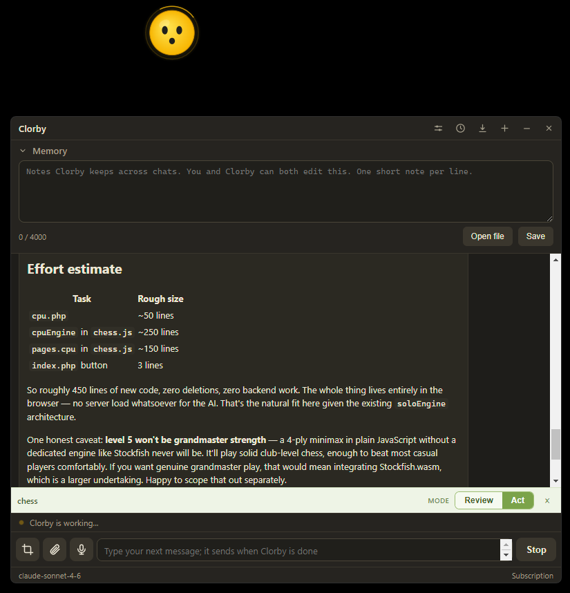

# Code review

Point Clorby at a project folder and it can read and discuss your code, and
(with your approval) make changes. Everything runs on your Claude subscription
through the Agent SDK. No API key is ever requested or stored.

  

## Opening a project

- In Settings, choose a project folder. A bar appears at the bottom of the panel with the project name and a clear Review / Act switch.
- Reading is confined to the project folder (plus the snips folder and any file you attach). Anything outside is refused.

## Review mode (read only)

- Review mode is the default and is read only: Clorby can read, search and list files in the project to answer questions, and cites file paths. It cannot change anything.
- If you ask for a change while in Review mode, Clorby shows a one-click "Switch to Act mode" card in the chat, so you are never stuck. Click it (or the Act side of the toggle in the project bar) and ask again.

## Act mode (edits, with approval)

- Act mode can edit files, but every change is shown as a diff and needs your approval: Allow once, Allow for this session, or Deny. While a card is waiting, the orb pulls its asking face.
- Terminal commands (Bash) are off by default and stay unavailable unless you turn them on in Settings, and even then each command still asks for approval.
- Clorby never bypasses these prompts. Tool activity shows as quiet lines in the transcript (for example "Read calc.js", or "Edit calc.js" with a diff).

## Continuation

While a project is open, Clorby keeps its memory and the conversation in the
folder itself, as `.clorbymem.md` and `.clorbychat.md`.

- Reopen the folder later and it loads both, resuming the same conversation so you carry on where you left off.
- If that session is not on this machine (for example after moving the folder to another computer), it shows the saved chat for reference and starts a fresh session.
- The `.clorbymem.md` notes are what Clorby remembers for that project, kept separate from the global memory used in general chat.
- You may want to add both files to the project's `.gitignore`.
