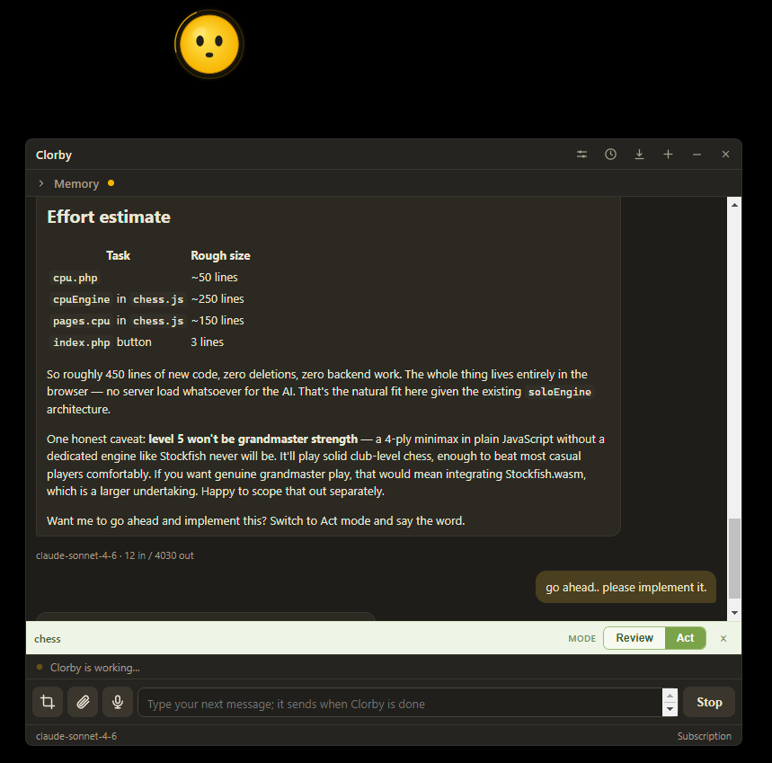
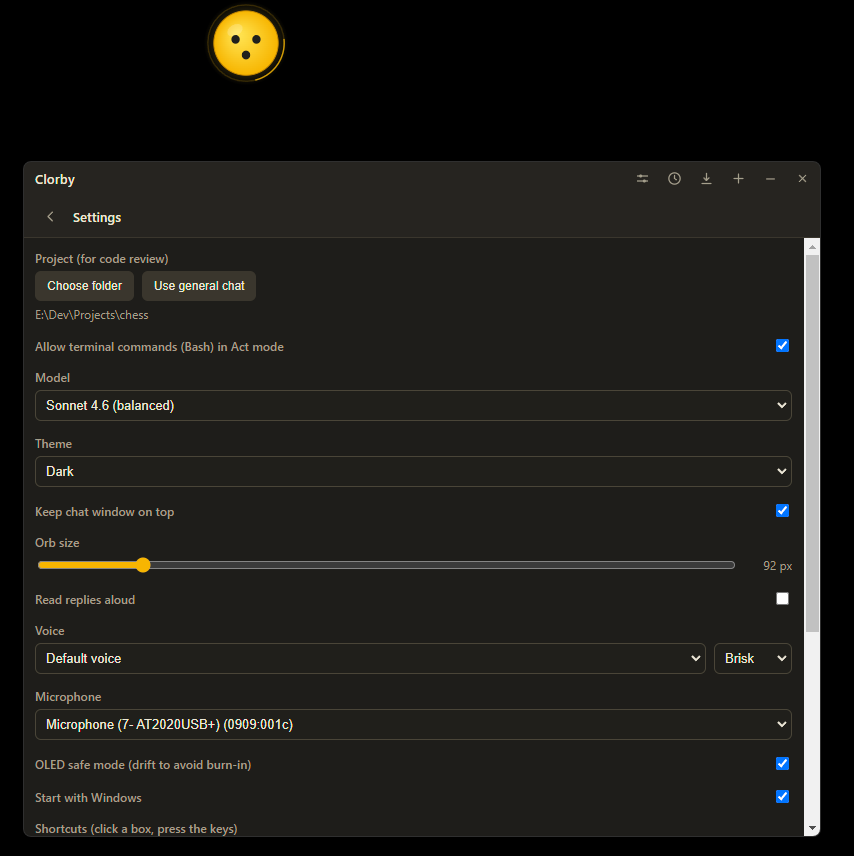

# Using Clorby

A tour of what the orb and the chat panel can do. For project code review see
[Code review](code-review.md); for what stays on your machine see
[Privacy and security](privacy.md).

## The orb

  

- The orb floats above other windows. Its transparent corners click through to whatever is behind them.
- Move your mouse and Clorby's eyes follow.
- Leave it alone for about half a minute and it gets drowsy, then falls asleep with little z bubbles. Move the mouse or click to wake it.
- Drag the orb to reposition it. The position is remembered across restarts, and it is pulled back on screen if a monitor is disconnected.
- A quick click (rather than a drag) opens or closes the chat panel.
- Right-click the orb for a short menu: Chat, Snip the screen, Hide Clorby, and Quit.
- You can set the orb to any size with the slider in Settings (about 64 to 260 px, with a live readout).
- Press and hold the orb (about half a second, without dragging) to talk: it starts listening, and when you let go it transcribes what you said into the message box.
- The tray menu offers Show or Hide Clorby, Open Chat, Snip and Ask, a Start with Windows toggle, a way to reveal settings.json, and Quit.

## The chat panel

  

- Type a message and press Enter (Shift+Enter for a new line) or click Send. Clorby streams the reply token by token, with Markdown.
- The orb reacts as it works: thinking before the first word, a busy "working" face while it runs tools, talking while streaming, a happy flash on success, a brief confused tilt when it is blocked from a tool, and a worried face on a real error.
- While Clorby is working it shows a small activity ring and stops following your mouse, and the chat shows a "Clorby is working..." line. Both clear when the reply finishes.
- You can keep typing while Clorby is replying. Press Enter and your message is queued (a "Queued" line appears, with an x to cancel) and sent automatically the moment the current reply finishes. Attachments you add in the meantime ride along with it.
- Stop interrupts a reply cleanly and keeps whatever arrived so far. Interrupting never loses the conversation: the thread and its context are kept, so you can carry straight on.
- Links in replies open in your real browser, and only over https.
- The footer shows the model and where billing goes: "Subscription" (your Claude plan, the normal case) or "API key". If an API key is detected, a warning banner also appears, because that bills the API rather than your plan.

The panel header has small icon buttons: Settings, History, Export chat, New chat, Minimise, and Close.

- New chat starts a fresh conversation.
- Export chat (the download icon) saves the current conversation to a Markdown file you choose.
- History lists your past Clorby chats by title and date. Click one to reopen it (the earlier messages are shown and you can carry on), or use the bin icon to delete it. The list shows only Clorby's own chats, not your terminal Claude Code sessions.
- Minimise sends the panel to the taskbar; Close tucks it away (click the orb to bring it back).

## Snip and ask

- Press Ctrl+Alt+S (or use the tray's Snip and Ask) to dim the screen and drag a box around anything. A live width by height readout follows the selection; Esc cancels.
- The snip appears as a chip on the chat input. Take several and they all ride along; remove any with the x on its chip. Type a question and send, and Clorby reads the images and answers about them.
- Snips are saved as PNGs under your user data folder and are read only from there. They are never uploaded anywhere except as part of the model request, and old ones are cleaned up automatically (default after 7 days).

## Attaching files

- Use the attach button by the message box (or right-click the orb and choose Attach a file), or just drag and drop files onto the chat window.
- The picker shows all files by default. You can attach several at once.
- Images show a thumbnail; other files (text, code, and similar) show by name. Clorby may only read the files you attached, nothing else.

## Voice

Voice is entirely local. Audio never leaves your machine.

### Voice in

- Hold the Talk button by the message box, hold the orb itself, or press the global talk shortcut (a toggle: press to start, press again to stop).
- Your words are transcribed on your machine with a local Whisper model and dropped into the message box for you to review and send, never sent automatically.
- While recording, the Talk button shows the elapsed time and a level meter, so you can see it is hearing you.
- If you have several microphones, pick the right one in Settings. The first use downloads the small model once (the only network call this makes); after that it works offline.

### Voice out

- In Settings, turn on "Read replies aloud" and Clorby reads each reply with your chosen Windows voice and speed. Your choices are remembered.

## Memory

- A collapsible Memory section sits at the top of the chat panel. Click the "Memory" header to expand it. Inside are the notes Clorby keeps across conversations, an editable text box, Save, and Open file.
- The notes are read at the start of every reply, so Clorby remembers your preferences, facts about you, and decisions from one chat to the next. Keep them short, one note per line.
- Both you and Clorby can edit the memory. When you tell Clorby something worth keeping, it can update the file itself: the change shows as a quiet "Updated its memory" line in the chat and the panel refreshes. Nothing is saved silently.
- The file on disk is the source of truth: clorby-memory.md in your user data folder for general chat, or .clorbymem.md in the folder when a project is open. Open file opens it in your editor; edits there refresh the panel too. If you have unsaved edits in the panel, an update from Clorby will not overwrite them.
- Memory rides in every request, so keep it small. The panel shows a character count and warns when you are over the limit. Do not store secrets in it.

## Settings

  

- Settings (the sliders icon) holds the model choice, a Light or Dark theme for the panel, a "Keep chat window on top" toggle, the orb size slider, voice on/off plus voice and speed, the microphone picker, OLED safe mode, a Start with Windows toggle, editable shortcuts, and how long to keep snips.
- "Keep chat window on top" is on by default (the panel floats above other windows); turn it off to let the panel sit behind whatever you are working in.
- OLED safe mode makes the orb drift very slowly around its spot so it never lights the same pixels for long. The drift travels a little further than the orb's own width and height, scales with the orb size, and stays on screen, which means in this mode the orb rests slightly in from a corner. It is meant for OLED screens, where a static bright image can cause burn-in. Turn it off to keep the orb perfectly still.
- Settings live in a plain settings.json under your user data folder (on Windows, `%APPDATA%\clorby\settings.json`). Use the tray item to reveal it in Explorer.

## Keyboard shortcuts

The default global shortcuts are:

- Ctrl+Alt+Space: toggle the chat panel
- Ctrl+Alt+S: snip a region and ask about it
- Ctrl+Alt+V: talk (toggle voice recording into the message box)

All three are editable in Settings: click a shortcut's box, press the keys, then Save. Changing them re-registers at once and tells you if one is already taken. If another app has already claimed one, Clorby logs it and carries on (the tray menu still works).

### Developer expression test

In a development build (not a packaged one), extra global shortcuts force each face for visual tuning:

- Ctrl+Alt+1 through Ctrl+Alt+9: idle, listening, thinking, talking, happy, error, asking, working, confused.
- Ctrl+Alt+Shift+1 through Ctrl+Alt+Shift+6: the moods, in order: yawn, smile, sleep, look-around, stretch, whistle.
